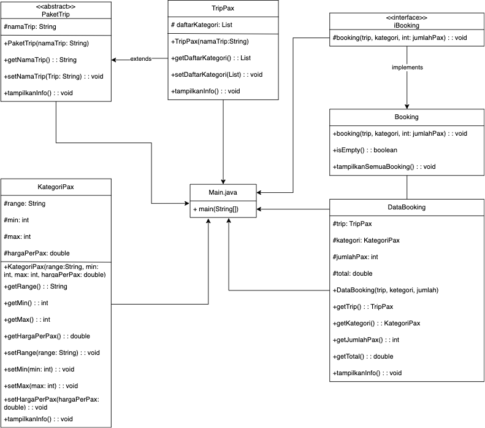

# Aplikasi Sederhana Booking Trip (OOP)

Sistem memungkinkan user untuk melihat daftar paket trip, memilih kategori pax sesuai jumlah peserta, dan melakukan pemesanan trip. Setiap kategori pax memiliki rentang dan harga berbeda, serta total harga akan dihitung otomatis.

## Struktur Folder
```bash
tree -d > structure.txt

## Struktur Class
- PaketTrip : Menyimpan informasi nama paket trip
- TripPax : Mempresentasikan paket trip, berisi daftar kategori pax
- KategoriPax : Menyimpan informasi seperti range pax, harga dan validasi jumlah pax
- Booking : Menyimpan daftar booking dan pengecekan apakah user sudah melakukan pemesanan
- iBooking : Mendefinisikan behavior dari class Booking
- DataBooking : Menyimpan dan mempresentasikan data booking yang sudah dilakukan user
- Main : Menyediakan menu CLI untuk user menjalankan program

## UML 


## Cara Menjalankan Program
1. Buka terminal/CMD
2. cd folder penyimpanan file
3. javac Main.java
4. java Main

### Wiwit Ramadhani

